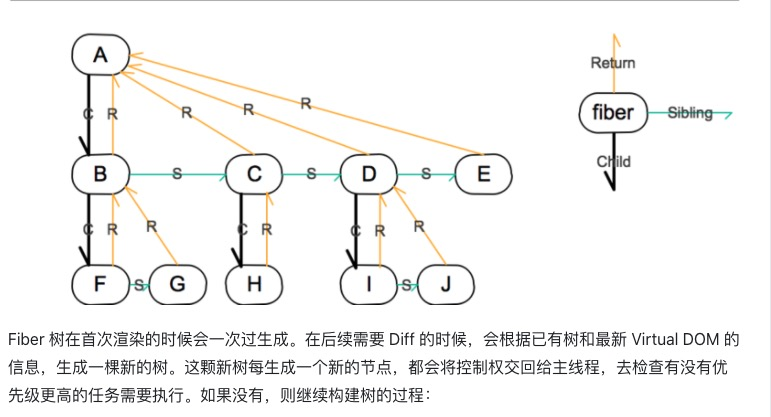
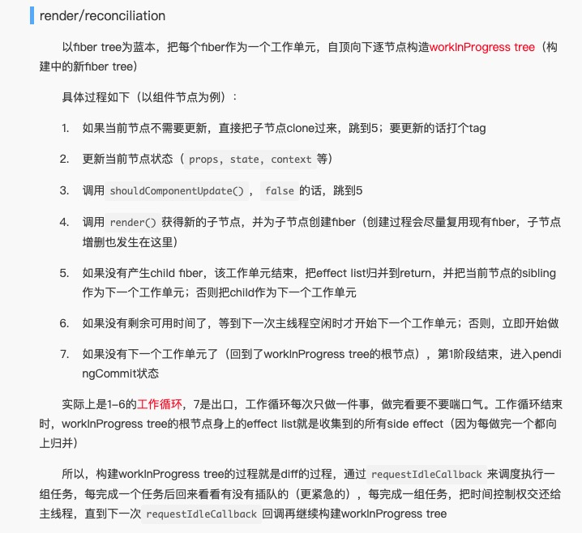

# study
学习群

# 学习总结
* 1. jsx可以传入type, attr, 和children 三个属性来实例化虚拟dom
* 2. document.createRange 可以精准操作dom元素，和dom元素片段，并且是安全性
* 3. 需要一个创建虚拟dom类和创建实例dom类，虚拟dom类的update比对是否更新
* 4. 比对虚拟dom，基本比对的是type，props，和children
* 5. props里函数，对象，数组等复杂类型数据和基本类型数据的比对，不一致再更新，children可以先比对数量
* 6. 文本类dom比对的是content属性
* 7. 框架里，最基本的两个生命周期，update 和 mount ，update可以由setState触发
* 8. 挂载dom元素到doucument需要挂载的位置，就需要range，所以每次更新时，都会存储当前dom节点的挂载位置
* 9. 正则 name.match(/^on([\s\S]+)$/) 来获取监听方法

## 真总结
* 1. JSX解析规则： jsx是js和xml结合的一种格式，react发明了jsx，利用html语法来创建虚拟dom，档期遇到 < 符号就当html解析，当遇到 { 就当js解析
* 2. jsx是先在内部转成 createElement 函数的形式，再去渲染，所以要先装babel/plugin-transform-react-jsx，可以用设置 pragma 设置用react的内置createElement还是其他自定义的createElement
* 3. Range对象，文档的连续范围区域，简单说，就是高亮选区，富文本编辑器经常用到的，插入dom的时候，创建range对象（document.createRange）=> 指定某个节点的终点位置（range.setStartAfter(node) range.setEndAfter(node)）为高亮选区的起始结束位置 => 插入element节点，range.insertNode(node)
* 4. 虚拟DOM用来比对更新差异，从而更新部分DOM节点，减少渲染数，而不是直接刷新全部节点，这样可以提升页面刷新性能；比对的是虚拟DOM 树，一般是平层比较，type, props, children，在react中，叫diff算法
* 5. 以前的React的diff算法是向下递归比对两棵虚拟dom树，如果是树跨层级变化的话，按照树的层级来比对，这样的话，就会是O(n^2)复杂度，再加上需要找出更新的节点，就是O(n^3)复杂度，如果是平层比较的话，复杂度就是O(n)，这里的ToyReact就只是平层比对，没搞那么复杂
* 6. 更新的DOM量很大，或者层级很深的话，其实js的执行时间就很长，这期间，用户还不能有交互，显然为了最小更新，需要占用更多js资源，顾此失彼，所有react就出了个Fiber算法，重构了react的虚拟dom更新
* 7. Fiber原理就是利用浏览器的window.requestIdleCallback这个api，https://segmentfault.com/a/1190000018250127
* 8. 主要分三层，虚拟dom层，描述页面；Reconciler 层，负责调用生命周期方法，进行diff运算；renderer层，根据不同平台，渲染对应页面，浏览器和rn
* 9. fiber是一个数据结构：

```
const fiber = {
    stateNode, // 节点实例
    child, // 子节点，注意，是child不是children
    sibling, // 兄弟节点
    return, // 父节点
}
```
所以有人说fiber是一个链表结构

* 10. 为了让Reconciler分段执行，就需要一个调度器来分配任务，任务优先级分6种：

* synchronous，首次渲染，同步执行
* task，在next tick之前执行
* animation，下一帧前执行-requestAnimationFrame调度
* high，上面完了再执行，不久将来执行-requestIdleCallback 回调执行的
* low，上面都完了再执行，延迟执行-requestIdleCallback 回调执行的
* offscreen，下一次render或者scroll时执行-requestIdleCallback 回调执行的

* 11. 比如键盘输入，高优先级任务，可以直接打断diff低优先级任务，
* 12. 但是在更新节点阶段，这个过程是不能被打断的，一次性批量更新的

* 13. diff阶段做了拆分，每次做完一段，就把时间控制权交给主线程


来自： http://www.ayqy.net/blog/dive-into-react-fiber/